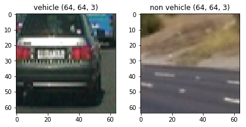
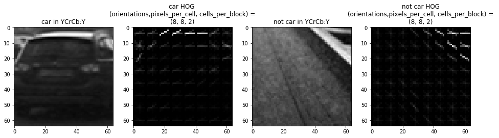
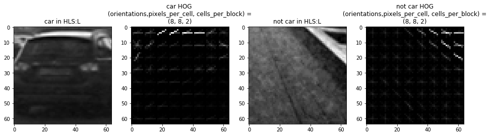
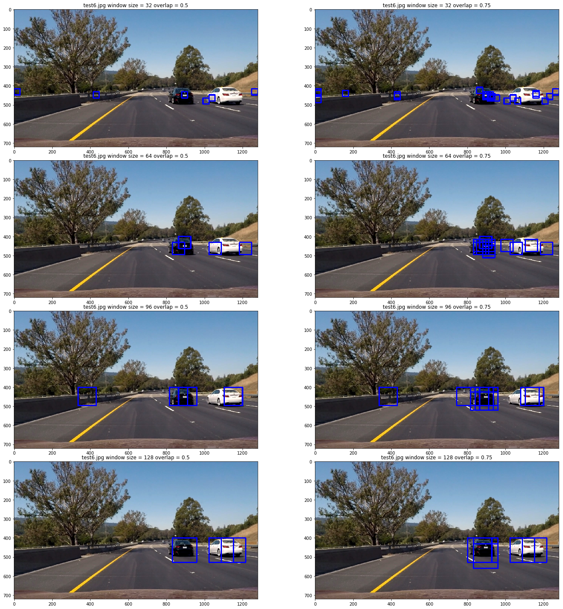
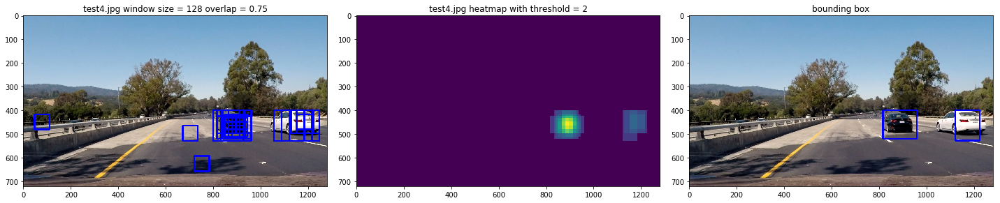

# **Self Driving: Vehicle Detection**

The goals / steps of this project are the following:

* Perform a Histogram of Oriented Gradients (HOG) feature extraction on a labeled training set of images and train a classifier Linear SVM classifier
* Optionally, you can also apply a color transform and append binned color features, as well as histograms of color, to your HOG feature vector. 
* Note: for those first two steps don't forget to normalize your features and randomize a selection for training and testing.
* Implement a sliding-window technique and use your trained classifier to search for vehicles in images.
* Run your pipeline on a video stream (start with the test_video.mp4 and later implement on full project_video.mp4) and create a heat map of recurring detections frame by frame to reject outliers and follow detected vehicles.
* Estimate a bounding box for vehicles detected.

[//]: # (Image References)
[image1]: ./examples/car_not_car.png
[image2]: ./examples/HOG_example.jpg
[image3]: ./examples/sliding_windows.jpg
[image4]: ./examples/sliding_window.jpg
[image5]: ./examples/bboxes_and_heat.png
[image6]: ./examples/labels_map.png
[image7]: ./examples/output_bboxes.png
[video1]: ./project_video.mp4

###Histogram of Oriented Gradients (HOG)

####1. HOG features extraction from the training images.

The code for this step is contained in the **"Histogram of Oriented Gradients (HOG)"** code cell of this [Jupyter notebook](./SelfDrvingVehicleDetection.ipynb).  

The flow was started by reading in all the `vehicle` and `non-vehicle` images.  Here is an example of one of each of the `vehicle` and `non-vehicle` classes:

I then explored different color spaces and different `skimage.hog()` parameters (`orientations`, `pixels_per_cell`, and `cells_per_block`).  I grabbed random images from each of the two classes and displayed them to get a feel for what the `skimage.hog()` output looks like.

Here are examples using the `YCrCb` color space, in `Y` color channel and "HLS" color space in "L" channel,  with HOG parameters of `orientations=8`, `pixels_per_cell=(8, 8)` and `cells_per_block=(2, 2)`:

####2. Final Choice of HOG parameters.

Various combinations of HOG parameters in different color space were tested and my final choice of HOG parameter combination is `orientations=9`, `pixels_per_cell=(8, 8)` and `cells_per_block=(2, 2)` in in `Y` color channel of 
`YCrCb` color space, which I think can differentiate between car and not car image most.

####3. Classifier training using HOG features.
The feature vectors of vehicle/non vehicle were extracted and splitted to training set and testing set with a ratio of 8:2. 
Several combinations of hyperparameter of SVM were tried to obtain the best performance. A SVM classifier with `rbf` kernal and `C = 10` was prepared. The test accuracy is 0.9916. The code for this step is contained in the **"SVM Classfier Trainning"** code cell of this [Jupyter notebook](./SelfDrvingVehicleDetection.ipynb). 

###Sliding Window Search

#### window scales and overlap ratio selection 
The code for sliding window search is contained in the **"Sliding Window Search"** code cell of this [Jupyter notebook](./SelfDrvingVehicleDetection.ipynb). The Y-direction search region was set to start from 400 to avoid mismatch since the lane is only available at the bottom half of the image. Several combinations of sliding window size (32, 64, 96, 128) and overlap ratio (0.5, 0.75) was tested. Below shows a test result with different widow size and overlap ratio. 

Based on the test image result, I decided to chose the sliding window scale of 64, 96 and 128 with overlap ratio of 0.75 as my serach parameters.

Ultimately I searched on 3 scales (64, 96, 128) using HLS color space's L channel HOG features , which provided a reasonable result. Here are some example images:

### Video Implementation

####1. a link to your final video output.
Here's a [link to my video result](./processed_project_video_3.mp4)

####2.filter for false positives filter and combining overlapping bounding boxes.

 I created a heatmap and then thresholded that map to identify vehicle positions.  I then used `scipy.ndimage.measurements.label()` to identify individual blobs in the heatmap.  I then assumed each blob corresponded to a vehicle.  I constructed bounding boxes to cover the area of each blob detected.  

Here's an example result showing the original sliding window, the heatmap and the final result of the bounding boxes.

---

###Discussion

From the video result we can see that some of the car were not captured properly and the bounding box didn't cover all the area of the car. It seems the feature selection were not selected very well. One major issue is when I tried to add spatial and color features the training process will increase by a margin. So did the in the video processing phase. In the future, fine-tuning on the feature selection is need.

Besides, we can find the car in the center region of the video, which is generally small, is not captured in current implantation. This is because the current scale of the sliding window is larger than the car. However, reduce the sliding window scale will also result in longer run time.

 

